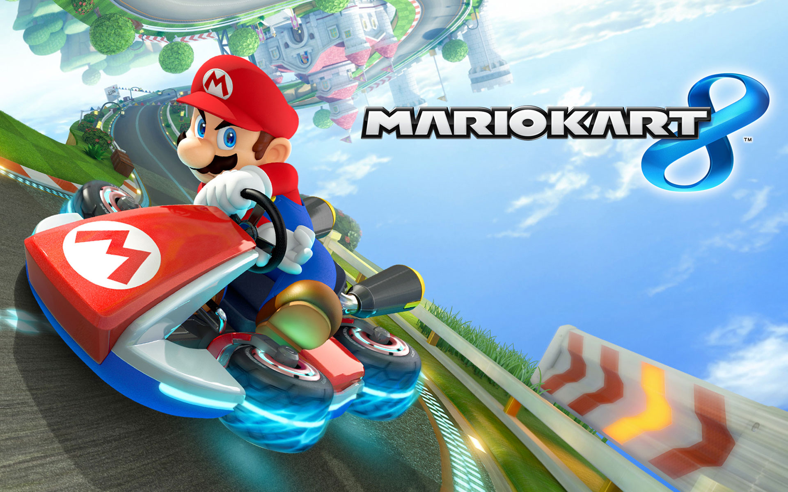

# Mario Kart 3.js - JavaScript/WebGL Mario Kart Game



**Demo Project:** This is a demo project that brings the magic of Mario Kart to your browser using Three.js and WebGL technology.

[Live Demo Link](mariokart-brown.vercel.app)

[](https://codespaces.new/Nathan-Richard-21/Mario-Kart-game)

## Features

- Modern homepage with animations using GSAP
- Both regular game mode and Time Trial mode
- Enhanced UI with game information display
- Realistic driving physics with drift mechanics
- Particle effects for drift, boosts, and more
- Sound effects and background music
- Responsive design that works on desktop and mobile
- Touch controls for mobile devices

## How to Install

1. Clone the repository:

```bash
git clone https://github.com/Basem321/Mario-Kart.git
cd Mario-Kart-game
```

2. Install dependencies:

```bash
npm install
# or
bun install
```

3. Start the development server:

```bash
npm run dev
# or
bun run dev
```

4. Open your browser and navigate to `http://localhost:5173` (or the URL displayed in your terminal)

## Game Controls

### Keyboard/Mouse
- <kbd>W</kbd> or <kbd>↑</kbd> - Accelerate
- <kbd>A</kbd>/<kbd>D</kbd> or <kbd>←</kbd>/<kbd>→</kbd> - Steer left/right
- <kbd>Space</kbd> - Drift (Hold and steer to maintain drift, release for mini-turbo)
- <kbd>E</kbd>/<kbd>G</kbd> - Drop bomb
- <kbd>H</kbd> - Honk
- <kbd>R</kbd> - Reset to the nearest safe point on the black road
- <kbd>Q</kbd> - Look behind (hold)

### Mobile
- Joystick on left side of the screen - Move/Steer
- Buttons on right side - Special actions (jump, use items)

## Game Modes

### Regular Mode
- Classic racing experience with regular controls

### Time Trial Mode
- Challenge yourself to beat your own record
- Tracks your best lap and total time

## Development Roadmap

- [x] Design modern landing page
- [x] Add Time Trial mode
- [x] Add game controls modal
- [x] Add countdown before race start
- [x] Implement background music and sound effects
- [x] Add smokes and particle effects
- [x] Add online P2P race lobbies
- [x] Add online leaderboard with player names and completed-lap standings
- [x] Add live online minimap with every racer's track position
- [x] Add Reset recovery to the nearest safe point on the black road
- [x] Restrict item-box spawns to the black road surface
- [ ] Add more items
- [ ] Add texture to the flame shaders
- [ ] Add curve/length modifiers to drift particles
- [ ] Add Skid marks
- [ ] Add wind screen effect when boosting
- [ ] Design additional tracks and checkpoints
- [ ] Add more items:
  - [ ] Tennis ball
  - [ ] Bomb
  - [ ] Red shell
  - [ ] Treats

## Project Information

This project is a non-profit fan project that recreates the fun of Mario Kart using web technologies. It's built with Three.js, React, and WebGL, demonstrating what's possible in modern web browsers.

The Mario Kart intellectual property is owned by Nintendo Co., Ltd. This project is not affiliated with Nintendo and is created for educational and demonstration purposes only.

## License

[](https://opensource.org/licenses/MIT)

MIT License

Copyright (c) 2025 Infinity Cybertech

This is a work by [Infinity Cybertech](https://www.infinitycybertech.com).

Permission is hereby granted, free of charge, to any person obtaining a copy
of this software and associated documentation files (the "Software"), to deal
in the Software without restriction, including without limitation the rights
to use, copy, modify, merge, publish, distribute, sublicense, and/or sell
copies of the Software, and to permit persons to whom the Software is
furnished to do so, subject to the following conditions:

The above copyright notice and this permission notice shall be included in all
copies or substantial portions of the Software.
